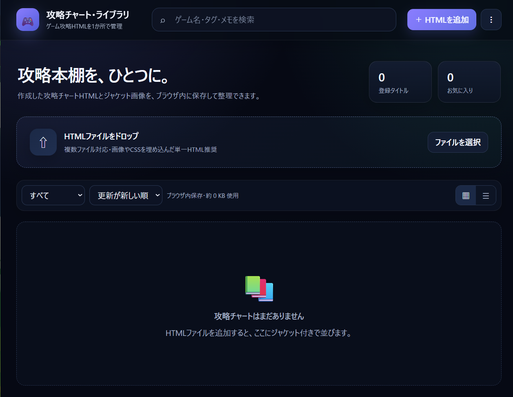

# Game Walkthrough Library

[English](README.md) | **日本語**

アカウント登録・インストール・外部アップロードなしで、ゲーム攻略HTMLをブラウザ内に保存・検索・整理できるローカルファーストのWebアプリです。

## デモ

https://take55699-pixel.github.io/game-walkthrough-library/

## すぐ試す

デモを開き、攻略が0件のときに表示される **「サンプルを試す」** を押してください。別ファイルをダウンロードしなくても、内蔵サンプルをすぐに確認できます。

## 主な機能

- HTMLファイルの追加
- ゲームタイトルの自動取得
- ジャケット画像の設定
- 検索・絞り込み・並べ替え
- お気に入り登録
- ブラウザ内へのローカル保存
- バックアップの書き出し・読み込み
- スマートフォン対応
- 日本語 / English 表示切替
- 選択した言語をブラウザに保存
- 内蔵サンプル攻略

## 使い方

1. デモページを開きます。
2. 「HTMLを追加」を押します。
3. 攻略チャートのHTMLファイルを選びます。
4. タイトル・プラットフォーム・タグ・ジャケット画像などを設定します。
5. 必要に応じてバックアップを書き出します。

## データ保存について

攻略HTML、ジャケット画像、メモなどは基本的に使用中のブラウザ内（IndexedDB）へ保存されます。サーバーへ攻略データをアップロードする仕組みはありません。

**重要:** ブラウザのサイトデータ削除、端末の初期化、ブラウザプロファイルの削除などでデータが消える可能性があります。大切なデータは定期的にバックアップを書き出してください。

## セキュリティ

信頼できないHTMLファイルを読み込まないでください。追加したHTMLにはJavaScriptが含まれている可能性があります。

アプリ内の攻略表示にはsandbox付きiframeを使用し、機能を制限しています。sandboxで動作しない攻略HTMLが必要な場合はHTMLを保存し、内容を確認したうえでアプリとは別に開いてください。

脆弱性の報告方法は [SECURITY.md](SECURITY.md) を参照してください。

## コントリビューション

IssueやPull Requestを歓迎します。手順は [CONTRIBUTING.md](CONTRIBUTING.md) を参照してください。

## ライセンス

[MIT License](LICENSE)
