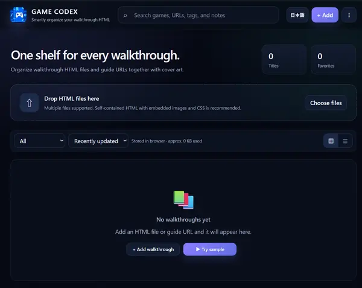

# GAME CODEX

[English](README.md) | **日本語**

ゲーム攻略HTMLと攻略サイトURLを、アカウント登録・インストール・外部アップロードなしでひとつに整理できるローカルファーストのWebアプリです。

## デモ

https://take55699-pixel.github.io/game-walkthrough-library/

## 主な機能

- 自作・生成済みの攻略HTMLファイルを登録
- `http` / `https` の攻略サイトURLを登録
- 登録した攻略HTMLをsandbox付きビューアーで表示
- 攻略HTMLが `localStorage` に保存する進捗を、GAME CODEX側のIndexedDBへ保存
- ジャケット画像・プラットフォーム・タグ・メモを設定
- ゲーム名・URL・タグ・メモから検索
- 絞り込み・並べ替え
- お気に入り登録
- グリッド / リスト表示
- 日本語 / English のUI切り替え（選択した言語はブラウザに保存）
- ライブラリが空のときだけ表示される **「サンプルを試す」** ボタン
- JSONバックアップの書き出し・読み込み
- スマートフォン対応
- ブラウザ内へのローカル保存

## 使い方

1. デモページを開きます。
2. 英語表示にする場合は **「EN」** を押します。選択した言語はブラウザに保存されます。
3. ライブラリが空の場合は **「サンプルを試す」** を押すと、同梱サンプルを自動で追加してすぐに開けます。
4. 自分の攻略を追加する場合は **「＋ 攻略を追加」** または上部の **「追加」** を押します。
5. 攻略HTMLファイル、または攻略サイトURLを選び、必要に応じてタイトル・プラットフォーム・タグ・メモ・ジャケット画像を設定します。
6. 大切なデータは定期的にバックアップしてください。

「サンプルを試す」では [`sample-walkthrough.html`](sample-walkthrough.html) を使用し、追加時に `SAMPLE` タグを付けます。

## データ保存について

攻略HTML、保存された進捗、ジャケット画像、メモなどは使用中のブラウザ内（IndexedDB）へ保存されます。GAME CODEXはアカウントを必要とせず、攻略ライブラリをアプリ用サーバーへアップロードする仕組みもありません。

**重要:** ブラウザのサイトデータ削除、端末の初期化、ブラウザプロファイルの削除などでデータが消える可能性があります。大切なデータは定期的にバックアップを書き出してください。

## 攻略サイトURLについて

攻略サイトURLを登録すると、可能な場合はアプリ内ビューアーで表示します。サイト側が `X-Frame-Options` や Content Security Policy で埋め込みを禁止している場合は表示できません。その場合は **「サイトを開く」** から別タブで開いてください。

## セキュリティ

信頼できないHTMLファイルを読み込まないでください。追加したHTMLにはJavaScriptが含まれている可能性があります。

- ローカルHTMLは `allow-same-origin` を付けないsandbox付き`iframe`で表示します。
- ローカルHTMLをアプリと同一オリジンになり得るトップレベルの `blob:` URLとして実行しません。
- 登録した外部URLは、接続先サイト自身のオリジンとセキュリティポリシーの影響を受けます。
- sandbox外でHTMLを実行する必要がある場合は、内容を確認し、信頼できるファイルだけを別途開いてください。

脆弱性の報告方法は [SECURITY.md](SECURITY.md) を参照してください。

## コントリビューション

IssueやPull Requestを歓迎します。手順は [CONTRIBUTING.md](CONTRIBUTING.md) を参照してください。

## ライセンス

[MIT License](LICENSE)
